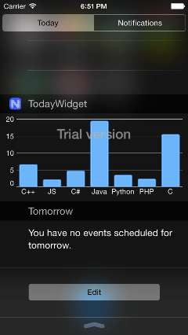

Today Widget app for NativeScript
=============================

This project demonstrates how you create a Today Widget for iOS using [NativeScript](https://www.nativescript.org) and [Telerik UI for iOS](http://www.telerik.com/ios-ui). After you clone the repo, you need to complete some steps in Xcode vital for the creation of the widget. These steps are described in the following blog article:

- [Making a Today widget in iOS with NativeScript and UI for NativeScript](https://www.nativescript.org/blog/details/making-a-today-widget-in-ios-with-nativescript-and-ui-for-nativescript)

The improved version of that project which implies how to create modules can be found at [this repo](https://github.com/nikolay-diyanov/sample-googleads-interstitial-mod).

## Showcased features and SDKs

Here is a list of the features that are showcased in this scenario:

- NativeScript ability to call native API from JavaScript
- Creating a Today Widget creating a target in Xcode

## Requirements  

The following is a list of requirements for the sample app:

- The [**NativeScript**](http://docs.nativescript.org/setup/quick-setup#the-nativescript-cli) runtime with CLI tools version 1.5.2 or above. 

